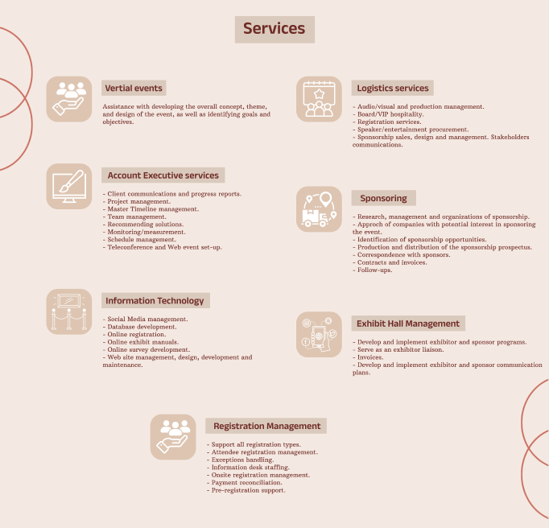
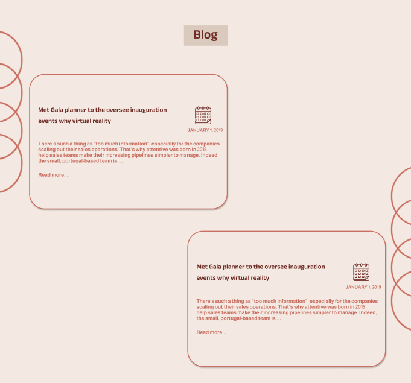
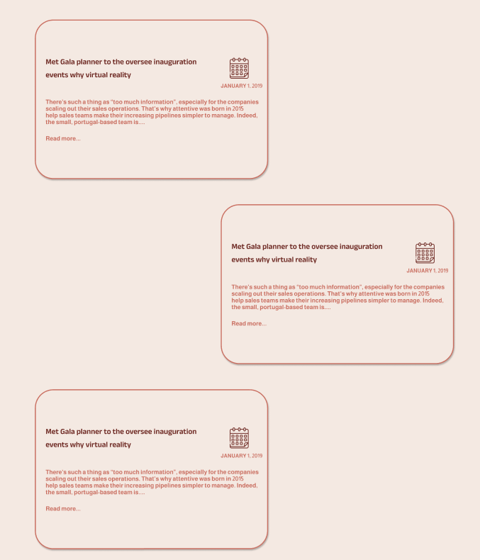
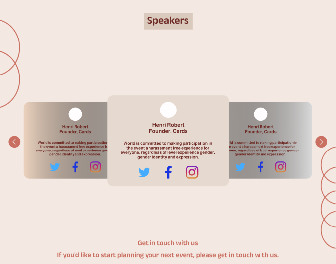
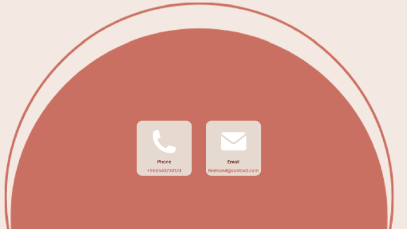

# Red Sand Technology.
This is the website of Red Sand Technology Company, with whom I am affiliated. The company specializes in assisting you with the organization of events, blogs, parties, or any other gatherings involving people. By creating an account on Red Sand, you can seamlessly coordinate and plan your events with their user-friendly interfaces. The website offers a total of seven interfaces that I have personally utilized and found beneficial in my association with them.

### 1- Home Page.

It is the overview about the Red Sand's website which shows all the services that can help you for organizing the events.

This page contains services which is:

#### 1) About Us.

#### 2) Categories.

#### 3) Services.

#### 4) Our Clients.

#### 5) Our Events.

#### 6) Blog.

#### 7) Contact Us.

